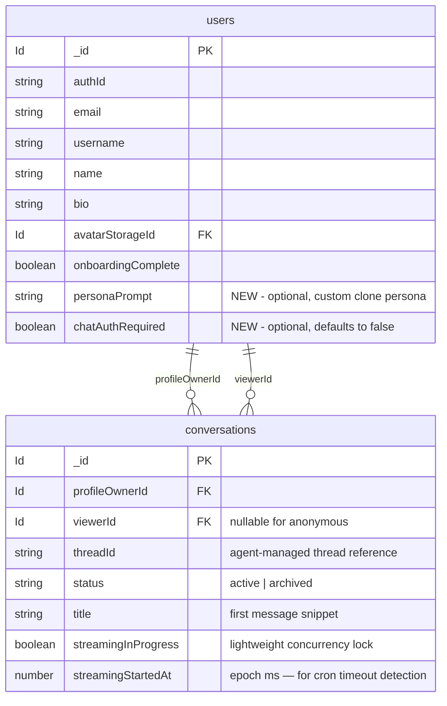

# feat: Chat Thread with Digital Clone

## Overview

Add a real-time chat thread to Mirror's profile page that lets viewers converse with an LLM-powered digital clone of the profile owner. When a viewer sends their first message, the left profile panel transitions (collapse + reveal) into a chat interface with streaming responses, conversation persistence, and a conversation list sidebar.

## Problem Statement / Motivation

Mirror turns blog articles into interactive experiences. Currently, readers can only passively consume articles. A chat clone bridges the gap — readers can ask questions, get personalized answers grounded in the author's writing, and engage in dialogue. This transforms a static profile into a living, conversational presence.

## Proposed Solution

Build a `features/chat/` module (following the `features/video-call/` pattern) with:
- **Convex backend**: `conversations` table (app metadata), `@convex-dev/agent` component (message storage + LLM streaming), and `@convex-dev/rate-limiter`
- **React frontend**: chat thread UI with streaming message rendering, conversation list, and a compact chat header
- **Profile shell integration**: `activeView: "profile" | "chat"` state replaces `chatOpen` boolean, with framer-motion collapse + reveal transition

(see brainstorm: `docs/brainstorms/2026-02-28-chat-thread-brainstorm.md`)

## Technical Approach

### Architecture

```
┌─────────────────────────────────────────────────────────────┐
│ Profile Shell (orchestrator)                                │
│   activeView: "profile" | "chat"                            │
│   ┌──────────────┐  ┌──────────────────────────────────┐    │
│   │ ProfileInfo   │  │ ChatThread (features/chat/)      │    │
│   │ (profile view)│  │  ├─ ChatHeader                   │    │
│   │               │◄─┤  ├─ ChatMessageList              │    │
│   │ Profile       │  │  ├─ ConversationList (sidebar)   │    │
│   │ ChatInput     │  │  └─ ChatInput                    │    │
│   │ (trigger)     │  │                                  │    │
│   └──────────────┘  └──────────────────────────────────┘    │
└─────────────────────────────────────────────────────────────┘
         │                        │
         ▼                        ▼
┌─────────────────────────────────────────────────────────────┐
│ Convex Backend (packages/convex/)                           │
│  ├─ chat/schema.ts (conversations table — agent owns msgs)  │
│  ├─ chat/mutations.ts (sendMessage, clearStreamingLock)     │
│  ├─ chat/queries.ts (getConversation, getConversations)     │
│  ├─ chat/actions.ts (streamResponse via @convex-dev/agent)  │
│  └─ chat/agent.ts (Agent definition, persona builder)       │
│  users/schema.ts += personaPrompt, chatAuthRequired         │
└─────────────────────────────────────────────────────────────┘
```

### Data Model (ERD)



> **Note:** Messages are stored internally by the `@convex-dev/agent` component. Our `conversations` table maps to agent threads via `threadId`. The agent manages message content, streaming deltas, and status. We do not define a `messages` table.

**Indexes:**
- `conversations`: `by_profileOwnerId_and_viewerId` (`["profileOwnerId", "viewerId"]`), `by_viewerId` (`["viewerId"]`), `by_threadId` (`["threadId"]` — unique in practice; used for cron lookups and future deep-link resolution)

### Streaming Mechanism (Updated from Brainstorm)

The brainstorm proposed manual `ctx.db.patch` from actions, but **actions cannot access `ctx.db`** (per `.claude/rules/convex.md`). The correct pattern uses `@convex-dev/agent`:

1. **Mutation** validates input + creates conversation (if first message) + saves user message via `saveMessage()` (instant reactivity) + schedules action via `ctx.scheduler.runAfter(0, ...)`
2. **Action** uses `@convex-dev/agent`'s `Agent.streamText()` with `saveStreamDeltas: { throttleMs: 100 }`
3. **Client** subscribes via `useUIMessages` hook (from `@convex-dev/agent/react`) with `stream: true`
4. Delta batching is handled by the agent library (not per-token mutations)

This resolves the brainstorm's crash hazard concern — `@convex-dev/agent` handles cleanup internally.

**Message storage architecture:** The `@convex-dev/agent` component owns its internal message/thread tables — it manages message content, streaming deltas, and message status. Our app-level `conversations` table stores metadata (profileOwnerId, viewerId, status, title) and a `threadId` reference that maps to the agent's internal thread. Access control is enforced at the conversation level — only authorized users can resolve `threadId` from a conversation, gating access to the agent's message data.

### Implementation Phases

#### Phase 1: Foundation — Schema + Dependencies

**Goal:** Database tables and packages ready for backend development.

**Tasks:**
- [ ] Install `@convex-dev/agent` and `@convex-dev/rate-limiter` in `packages/convex/`
- [ ] Register both components in `packages/convex/convex/convex.config.ts`
- [ ] Add `personaPrompt` and `chatAuthRequired` fields to `packages/convex/convex/users/schema.ts` — both as `v.optional()`. Runtime defaults: `personaPrompt ?? null` uses default system prompt, `chatAuthRequired ?? false` allows anonymous chat
- [ ] Create `packages/convex/convex/chat/schema.ts` with `conversations` table (agent component owns message storage)
- [ ] Register new tables in `packages/convex/convex/schema.ts`
- [ ] Run `pnpm exec convex codegen` to generate types
- [ ] Verify with `pnpm build`

**Files:**
- `packages/convex/package.json` (add deps)
- `packages/convex/convex/convex.config.ts` (new file — register agent + rate-limiter components)
- `packages/convex/convex/users/schema.ts` (add fields)
- `packages/convex/convex/chat/schema.ts` (new file)
- `packages/convex/convex/schema.ts` (import chat tables)

<details>
<summary>packages/convex/convex/chat/schema.ts (pseudo)</summary>

```typescript
import { defineTable } from "convex/server";
import { v } from "convex/values";

export const conversationFields = {
  profileOwnerId: v.id("users"),
  viewerId: v.optional(v.id("users")),
  threadId: v.string(), // maps to @convex-dev/agent internal thread
  status: v.union(v.literal("active"), v.literal("archived")),
  title: v.string(),
  streamingInProgress: v.optional(v.boolean()), // lightweight concurrency lock
  streamingStartedAt: v.optional(v.number()), // epoch ms — cron compares against Date.now() for timeout
};

export const conversationsTable = defineTable(conversationFields)
  .index("by_profileOwnerId_and_viewerId", ["profileOwnerId", "viewerId"])
  .index("by_viewerId", ["viewerId"])
  .index("by_threadId", ["threadId"]); // unique in practice; cron + future deep-links

// Messages are managed by @convex-dev/agent component internally.
// No messages table defined here — subscribe via useUIMessages({ threadId }).
```

</details>

---

#### Phase 2: Backend — Convex Functions + Agent

**Goal:** Working chat backend with LLM streaming.

**Tasks:**
- [ ] Create `packages/convex/convex/chat/agent.ts` — define the Agent with provider-agnostic LLM config
- [ ] Create `packages/convex/convex/chat/mutations.ts` — `sendMessage` (regular mutation with optional auth via `safeGetAuthUser`, creates conversation if needed, schedules LLM action, enforces rate limit), `clearStreamingLock` (internal mutation — clears both `streamingInProgress` and `streamingStartedAt`)
- [ ] Add conversation ownership validation in `sendMessage` (verify conversationId belongs to profileOwnerId and current viewer)
- [ ] Create `packages/convex/convex/chat/actions.ts` — `streamResponse` (internal action, uses Agent.streamText with saveStreamDeltas, clears `streamingInProgress` lock on completion/error)
- [ ] Create `packages/convex/convex/chat/queries.ts` — `getConversation` (public, access-controlled for UI), `internalGetConversation` (internal query, no auth checks — for use by `streamResponse` action which has no viewer context), `getConversations` (by viewerId + profileOwnerId; viewer sees only own conversations, owner sees all on their profile), `listThreadMessages` (wraps `listUIMessages` + `syncStreams` from `@convex-dev/agent`; access-gated by conversation ownership before resolving threadId)
- [ ] Create `packages/convex/convex/chat/helpers.ts` — persona prompt builder (articles + bio + custom prompt)
- [ ] Set up rate limiter in `packages/convex/convex/chat/rateLimits.ts` — two-tier for anonymous: per-profileOwnerId throttle on new conversation creation (scoped to prevent noisy-neighbor), per-conversationId on subsequent messages
- [ ] Add input validation in `sendMessage` (empty/oversized content rejection — empty after trim or >4000 chars)
- [ ] Add concurrency guard in `sendMessage` (reject if `conversation.streamingInProgress === true` — single document read, no `.filter()`)
- [ ] Add context windowing in `loadPersonaContext` — takes both `profileOwnerId` and `conversationId`, loads messages **only from the given conversationId** (never cross-conversation), `MAX_CONTEXT_MESSAGES = 20`, excludes `error`/`superseded` messages
- [ ] Add safety prefix to system prompt in `helpers.ts` (non-negotiable clone identity boundaries, prepended before `personaPrompt`)
- [ ] Add stale-stream cleanup cron in `packages/convex/convex/crons.ts` — queries conversations where `streamingInProgress === true` and `Date.now() - streamingStartedAt > 2 minutes`, clears lock via `clearStreamingLock`
- [ ] Verify with `pnpm exec convex dev` (functions deploy successfully)

**Files:**
- `packages/convex/convex/chat/agent.ts` (new)
- `packages/convex/convex/chat/mutations.ts` (new)
- `packages/convex/convex/chat/actions.ts` (new — `"use node"`)
- `packages/convex/convex/chat/queries.ts` (new)
- `packages/convex/convex/chat/helpers.ts` (new)
- `packages/convex/convex/chat/rateLimits.ts` (new)
- `packages/convex/convex/crons.ts` (new or update existing)

<details>
<summary>Mutation pattern (sendMessage pseudo)</summary>

```typescript
// packages/convex/convex/chat/mutations.ts
import { mutation } from "../_generated/server";
import { v } from "convex/values";
import { ConvexError } from "convex/values";
import { internal } from "../_generated/api";
import { rateLimiter } from "./rateLimits";
import { authComponent } from "../lib/auth";
import { createThread, saveMessage } from "@convex-dev/agent";
import { components } from "../_generated/api";

export const sendMessage = mutation({
  args: {
    profileOwnerId: v.id("users"),
    conversationId: v.optional(v.id("conversations")),
    content: v.string(),
  },
  returns: v.object({
    conversationId: v.id("conversations"),
  }),
  handler: async (ctx, args) => {
    // --- Input validation ---
    const trimmed = args.content.trim();
    if (trimmed.length === 0) throw new ConvexError("Message cannot be empty");
    if (args.content.length > 4000) throw new ConvexError("Message too long");

    // --- Optional auth (supports anonymous chat) ---
    const authUser = await authComponent.safeGetAuthUser(ctx);
    const profileOwner = await ctx.db.get(args.profileOwnerId);
    if (!profileOwner) throw new ConvexError("Profile not found");
    if (profileOwner.chatAuthRequired === true && !authUser) {
      throw new ConvexError("Sign in required");
    }

    // --- Conversation ownership validation ---
    // NOTE: For anonymous users, viewerId is undefined on both sides, so the
    // check passes for any unauthenticated caller who obtains a conversationId.
    // This is acceptable for MVP — conversationIds are opaque Convex IDs (not
    // guessable). Full mitigation requires anonymous session tokens (see Future
    // Considerations). The risk is low: an attacker would need to obtain a valid
    // conversationId, and anonymous conversations contain no PII by design.
    if (args.conversationId) {
      const conversation = await ctx.db.get(args.conversationId);
      if (!conversation) throw new ConvexError("Conversation not found");
      if (conversation.profileOwnerId !== args.profileOwnerId) {
        throw new ConvexError("Conversation does not belong to this profile");
      }
      const viewerId = authUser?._id;
      if (conversation.viewerId !== viewerId) {
        throw new ConvexError("Not authorized for this conversation");
      }
    }

    // --- Rate limit (two-tier for anonymous) ---
    if (authUser) {
      // Authenticated: per-user rate limit
      await rateLimiter.limit(ctx, "sendMessage", { key: authUser._id, throws: true });
    } else if (args.conversationId) {
      // Anonymous with existing conversation: per-conversation rate limit
      await rateLimiter.limit(ctx, "sendMessage", { key: args.conversationId, throws: true });
    } else {
      // Anonymous first message (new conversation): per-profile throttle to prevent conversation-creation spam
      // Scoped to profileOwnerId so one abusive actor can't starve other profiles
      await rateLimiter.limit(ctx, "createConversation", { key: args.profileOwnerId, throws: true });
    }

    // --- Concurrency guard (single document read, no .filter()) ---
    if (args.conversationId) {
      const conversation = await ctx.db.get(args.conversationId);
      if (conversation?.streamingInProgress === true) {
        throw new ConvexError("A response is already in progress");
      }
    }

    // --- Create conversation if first message ---
    let conversationId = args.conversationId;
    let threadId: string;
    if (!conversationId) {
      // createThread is the standalone function — works in mutations (unlike agent.createThread which is action-only)
      threadId = await createThread(ctx, components.agent, {
        userId: authUser?._id,
      });
      conversationId = await ctx.db.insert("conversations", {
        profileOwnerId: args.profileOwnerId,
        viewerId: authUser?._id, // undefined for anonymous
        threadId,
        status: "active" as const,
        title: trimmed.slice(0, 100),
      });
    } else {
      const conversation = await ctx.db.get(conversationId);
      threadId = conversation!.threadId;
    }

    // --- Save user message immediately (shows up reactively before action starts) ---
    const { messageId } = await saveMessage(ctx, components.agent, {
      threadId,
      prompt: trimmed,
    });

    // --- Set concurrency lock with timestamp for cron timeout detection ---
    await ctx.db.patch(conversationId, {
      streamingInProgress: true,
      streamingStartedAt: Date.now(),
    });

    // --- Schedule LLM response ---
    await ctx.scheduler.runAfter(0, internal.chat.actions.streamResponse, {
      conversationId,
      profileOwnerId: args.profileOwnerId,
      promptMessageId: messageId,
    });

    return { conversationId };
  },
});
```

</details>

<details>
<summary>Agent + streaming action (pseudo)</summary>

```typescript
// packages/convex/convex/chat/agent.ts
import { Agent } from "@convex-dev/agent";
import { components } from "../_generated/api";

// Provider-agnostic: swap the model import based on env config
export const cloneAgent = new Agent(components.agent, {
  instructions: "", // overridden per-call with persona context
  // languageModel configured at call time or via env
});

// packages/convex/convex/chat/actions.ts
"use node";

import { internalAction } from "../_generated/server";
import { v } from "convex/values";
import { cloneAgent } from "./agent";
import { internal } from "../_generated/api";

export const streamResponse = internalAction({
  args: {
    conversationId: v.id("conversations"),
    profileOwnerId: v.id("users"),
    promptMessageId: v.string(), // from saveMessage() in mutation
  },
  returns: v.null(),
  handler: async (ctx, args) => {
    // Entire handler wrapped in try/finally so lock is ALWAYS cleared,
    // even if conversation lookup or persona context loading fails.
    try {
      // Load conversation to get agent threadId
      // Uses internalGetConversation (no auth checks) — internal actions have no viewer context
      const conversation = await ctx.runQuery(
        internal.chat.queries.internalGetConversation,
        { conversationId: args.conversationId },
      );

      // Load persona context (articles, bio, persona prompt) — scoped to conversation
      const context = await ctx.runQuery(
        internal.chat.queries.loadPersonaContext,
        { profileOwnerId: args.profileOwnerId, conversationId: args.conversationId },
      );

      // Stream with batched delta writes (100ms throttle)
      // promptMessageId links to user message saved in mutation — enables instant display
      // and automatic retry context inclusion
      await cloneAgent.streamText(
        ctx,
        { threadId: conversation.threadId },
        { promptMessageId: args.promptMessageId },
        {
          systemPrompt: context.systemPrompt,
          saveStreamDeltas: { throttleMs: 100 },
        },
      );
    } finally {
      // Clear concurrency lock on completion or error — guaranteed to run
      await ctx.runMutation(internal.chat.mutations.clearStreamingLock, {
        conversationId: args.conversationId,
      });
    }

    return null;
  },
});
```

</details>

---

#### Phase 3: Frontend — Chat Feature Module

**Goal:** Self-contained `features/chat/` module with all UI components.

**Tasks:**
- [ ] Create `apps/mirror/features/chat/types.ts` — ChatMessage, Conversation, ChatState types
- [ ] Create `apps/mirror/features/chat/context/chat-context.tsx` — ChatProvider wrapping conversation state + messages subscription
- [ ] Create `apps/mirror/features/chat/hooks/use-chat.ts` — send message mutation with `optimisticallySendMessage` (from `@convex-dev/agent/react`) for instant display, subscribe to streaming via `useUIMessages(api.chat.queries.listThreadMessages, { threadId }, { stream: true })` (reads from agent's message storage, gated by conversation access control)
- [ ] Create `apps/mirror/features/chat/hooks/use-conversations.ts` — list/create/switch conversations
- [ ] Create `apps/mirror/features/chat/components/chat-header.tsx` — compact header (Back, avatar+name, + button)
- [ ] Create `apps/mirror/features/chat/components/chat-message.tsx` — message bubble (user = blue right-aligned, assistant = white left-aligned with avatar)
- [ ] Create `apps/mirror/features/chat/components/chat-message-list.tsx` — scrollable message list with auto-scroll on new messages
- [ ] Create `apps/mirror/features/chat/components/chat-input.tsx` — in-thread input (uses `use-chat` send, distinct from profile trigger input)
- [ ] Create `apps/mirror/features/chat/components/chat-thread.tsx` — main container composing header + message list + input
- [ ] Create `apps/mirror/features/chat/components/conversation-list.tsx` — sidebar/sheet listing past conversations
- [ ] Create `apps/mirror/features/chat/index.ts` — barrel exports
- [ ] Add privacy disclosure in `ChatInput`: show "Conversations may be visible to [profile owner name]" below the chat input
- [ ] Verify with `pnpm build --filter=@feel-good/mirror`

**Files:** All under `apps/mirror/features/chat/` (new directory)

**Component props design:**
- `ChatThread` accepts `profileOwnerId: Id<"users">`, `profileName: string`, `avatarUrl: string | null`, `onBack: () => void` — no `Profile` type dependency
- `ChatHeader` accepts `profileName`, `avatarUrl`, `onBack`, `onNewConversation`
- `ChatMessage` accepts `role`, `content`, `status`, `avatarUrl` (for assistant)
- `ConversationList` accepts `conversations`, `activeConversationId`, `onSelect`

---

#### Phase 4: Profile Shell Integration — View Transition

**Goal:** Smooth transition between profile and chat views on both desktop and mobile.

**Tasks:**
- [ ] Modify `apps/mirror/app/[username]/_components/profile-shell.tsx`:
  - Replace `chatOpen: boolean` with `activeView: "profile" | "chat"` + `activeConversationId: Id<"conversations"> | null`
  - Profile `ChatInput` gets `onSend` callback that creates conversation + transitions view
  - Desktop: AnimatePresence switches between ProfileInfo and ChatThread in left panel
  - Mobile: When `activeView === "chat"`, bypass `MobileProfileLayout` entirely and render full-screen ChatThread
- [ ] Update `apps/mirror/features/profile/components/chat-input.tsx` — add `onSend?: (message: string) => void` prop, call it from `handleSend` instead of just clearing
- [ ] Implement collapse + reveal framer-motion transition (profile content → compact chat header)
- [ ] Wire "Back" button to set `activeView = "profile"` and keep `activeConversationId` so re-opening resumes
- [ ] Wire "+" button to create new conversation via `use-conversations`
- [ ] Verify desktop transition visually
- [ ] Verify mobile full-screen takeover

**Files:**
- `apps/mirror/app/[username]/_components/profile-shell.tsx` (modify)
- `apps/mirror/features/profile/components/chat-input.tsx` (modify — add `onSend` prop)
- `apps/mirror/features/profile/index.ts` (no change needed — ChatInput already exported)

<details>
<summary>Profile shell state changes (pseudo)</summary>

```typescript
// Replace:
const [chatOpen, setChatOpen] = useState(false);

// With:
const [activeView, setActiveView] = useState<"profile" | "chat">("profile");
const [activeConversationId, setActiveConversationId] =
  useState<Id<"conversations"> | null>(null);

// Profile ChatInput onSend:
const handleFirstMessage = async (message: string) => {
  const { conversationId } = await sendMessage({
    profileOwnerId: profile._id,
    content: message,
  });
  setActiveConversationId(conversationId);
  setActiveView("chat");
};

// ChatThread onBack:
const handleBackToProfile = () => {
  setActiveView("profile");
  // Keep activeConversationId so re-opening resumes
};
```

</details>

---

#### Phase 5: Polish — Auth Gate, Rate Limits, Error States

**Goal:** Production-ready edge cases and error handling.

**Tasks:**
- [ ] Implement auth gate in profile ChatInput: if `chatAuthRequired === true && !isAuthenticated`, show sign-in prompt on send attempt
- [ ] Add rate limit error handling in ChatInput: catch `ConvexError` from rate limiter, show inline "Rate limit reached" message with retry timer
- [ ] Add error state UI for failed streaming messages (error indicator + retry button below partial content)
- [ ] Add retry handler: re-schedule `streamResponse` action via agent API. `loadPersonaContext` excludes error messages from LLM context
- [ ] Disable send button while `conversation.streamingInProgress === true`
- [ ] Add stale-stream cleanup cron (conversations where `streamingInProgress === true` and `Date.now() - streamingStartedAt > 2 minutes` → clear lock via `clearStreamingLock`)
- [ ] Add empty state for ChatThread (no messages yet — show welcome prompt)
- [ ] Add default system prompt fallback when `personaPrompt` is null
- [ ] Test end-to-end: send message → stream response → conversation persists → page refresh resumes

**Files:**
- `apps/mirror/features/chat/components/chat-message.tsx` (error state UI)
- `apps/mirror/features/chat/hooks/use-chat.ts` (error handling, retry)
- `apps/mirror/features/profile/components/chat-input.tsx` (auth gate)
- `packages/convex/convex/chat/helpers.ts` (default system prompt)
- `packages/convex/convex/crons.ts` (stale cleanup)

## Alternative Approaches Considered

| Approach | Why Rejected |
|----------|-------------|
| **B: Chat as Profile Sub-feature** | Bloats profile feature with chat concerns; profile context becomes heavy (see brainstorm) |
| **C: Hybrid — shared backend, profile-hosted UI** | Blurry feature boundary; chat UI in profile creates wrong-direction cross-feature dependency |
| **Manual `db.patch` streaming** | Actions cannot use `ctx.db`; per-token `ctx.runMutation` is too expensive (~50ms each). `@convex-dev/agent` handles batched delta writes correctly |
| **HTTP streaming via `httpAction` + SSE** | Bypasses Convex real-time subscription model; requires separate auth handling. `@convex-dev/agent` delta streaming is the Convex-native approach |

## System-Wide Impact

### Interaction Graph

```
User sends message (UI)
  → Profile ChatInput.onSend(message)
  → Convex mutation: chat.mutations.sendMessage
    → safeGetAuthUser() — resolve viewer (optional for anonymous)
    → input validation — reject empty or oversized content
    → conversation ownership check — verify conversationId belongs to profile + viewer
    → rateLimiter.limit() — two-tier: per-user (auth) or per-conversation/per-profile (anon)
    → concurrency guard — reject if conversation.streamingInProgress === true
    → createThread() + ctx.db.insert("conversations") — if first message
    → saveMessage() — user message saved to agent (instant reactivity)
    → ctx.db.patch(conversationId, { streamingInProgress: true })
    → ctx.scheduler.runAfter(0, internal.chat.actions.streamResponse)
      → Agent.streamText({ promptMessageId }) — calls LLM API via agent thread
        → DeltaStreamer batches tokens → agent component writes to internal tables
        → streamingInProgress cleared on completion/error
  → Client useUIMessages({ threadId }) subscribes to agent's message storage
  → ChatMessageList re-renders with progressive token display
```

### Error Propagation

- **Rate limit error**: `ConvexError` from `@convex-dev/rate-limiter` → caught by `useMutation` error handler → displayed inline in chat UI
- **LLM API error**: Caught in action handler → `streamingInProgress` cleared via `clearStreamingLock` → agent marks message as error → client sees error state
- **Action crash (unhandled)**: `streamingInProgress` stays `true` → cron job detects after 2 minutes → clears lock + marks conversation stale
- **Auth error**: `sendMessage` checks `chatAuthRequired === true` — if profile owner requires auth and no user is signed in, throws `ConvexError("Sign in required")` → caught in `onSend` → redirect to `/sign-in?next=/@username`. Anonymous users are allowed when `chatAuthRequired` is false or undefined.
- **Ownership error**: `ConvexError("Conversation does not belong to this profile")` or `ConvexError("Not authorized for this conversation")` → caught in `onSend` → displayed inline. Prevents cross-conversation injection.
- **Input validation error**: `ConvexError("Message cannot be empty")` or `ConvexError("Message too long")` → caught in `onSend` → displayed inline
- **Concurrency error**: `ConvexError("A response is already in progress")` → caught in `onSend` → send button remains disabled
- **Network disconnect**: Convex client auto-reconnects; `useUIMessages` re-syncs from agent's persisted state

### State Lifecycle Risks

- **Partial message on crash**: Agent preserves partial content internally. UI shows partial text + error indicator via `useUIMessages`.
- **Orphaned conversation**: If mutation creates conversation but action scheduling fails, conversation exists with `streamingInProgress: true` and no messages. Cron clears the lock; user can send another message.
- **Stale streaming**: Cron-based cleanup (2-minute threshold) clears `streamingInProgress` lock, prevents permanent spinner.

### API Surface Parity

- All chat functions are new — no existing interfaces to update
- Profile `ChatInput` gains an `onSend` prop but remains backward-compatible (prop is optional)

## Acceptance Criteria

### Functional Requirements

- [ ] Viewer can type and send a message on any profile page
- [ ] First message creates a conversation and transitions profile panel to chat thread (collapse + reveal animation)
- [ ] Clone responds with streaming tokens that appear progressively
- [ ] Messages persist — refreshing the page and re-opening chat shows conversation history
- [ ] "+" button creates a new conversation; previous conversations accessible in conversation list
- [ ] "Back" button returns to profile view; re-opening chat resumes the last conversation
- [ ] Conversation list sidebar shows past conversations with title (first message snippet)
- [ ] Clone context includes profile owner's articles, bio, and custom persona prompt
- [ ] Profile owner can set `chatAuthRequired` to gate anonymous chatting
- [ ] Rate limiting prevents message spam (enforced server-side)
- [ ] Streaming errors show error state with retry button
- [ ] Mobile: chat takes over full screen; Back returns to profile

### Non-Functional Requirements

- [ ] Streaming tokens appear within 500ms of send (excluding LLM latency)
- [ ] Messages render without layout shift during streaming
- [ ] Rate limiter does not block normal conversation pace (10 messages/minute baseline)
- [ ] No `Profile` type imported in `features/chat/` — clean module boundary

### Quality Gates

- [ ] `pnpm build` passes (all apps)
- [ ] `pnpm lint` passes
- [ ] Desktop and mobile transitions verified visually
- [ ] End-to-end flow verified: send → stream → persist → refresh → resume

## Dependencies & Prerequisites

| Dependency | Status | Notes |
|-----------|--------|-------|
| `@convex-dev/agent` | To install | Handles streaming delta writes to Convex |
| `@convex-dev/rate-limiter` | To install | Token bucket rate limiting |
| LLM API key | Required | Environment variable for chosen provider (Claude/OpenAI) |
| Convex deployment | Existing | Schema push needed after table creation |
| `framer-motion` | Already installed | Used for collapse + reveal transition |

## Risk Analysis & Mitigation

| Risk | Likelihood | Impact | Mitigation |
|------|-----------|--------|------------|
| `@convex-dev/agent` API mismatch with current Convex version | Medium | High | Pin version; verify compatibility before Phase 1 |
| LLM response quality with articles as context | Low | Medium | Default system prompt provides guardrails; owner can customize |
| Streaming latency on slow LLM providers | Medium | Medium | Show typing indicator immediately; batch delta writes at 100ms |
| Rate limiter too aggressive for normal use | Low | Low | Token bucket with burst capacity; configurable per-profile later |
| Mobile keyboard layout issues | Medium | Medium | Use `env(safe-area-inset-bottom)` and `scrollIntoView` for input |
| Prompt injection / clone reputation damage | Medium | High | Safety prefix prepended to all system prompts with non-negotiable identity boundaries; input moderation deferred to future consideration |
| Context window overflow on long conversations | High | High | Sliding window of last 20 messages (`MAX_CONTEXT_MESSAGES`); `error`/`superseded` messages excluded from context |
| Anonymous abuse without auth gate | Medium | Medium | Two-tier rate limiting for anonymous (per-profile creation throttle + per-conversation); profile owners can enable `chatAuthRequired` to gate all chat |

## Resolved Design Questions

(Carried forward from brainstorm — see `docs/brainstorms/2026-02-28-chat-thread-brainstorm.md`)

| Question | Resolution | Default Assumption |
|----------|-----------|-------------------|
| Auth gate trigger point | Gate fires on send attempt (not on button click) | Typed message is not preserved through redirect |
| Anonymous viewer identity | Two-tier rate limiting for anonymous: per-profile first-message throttle + per-conversation message throttle; no conversation persistence across reloads | Can be upgraded to anonymous session tokens later |
| Can owner chat with own clone? | Yes — useful for testing persona | `viewerId === profileOwnerId` in conversations table |
| Mid-stream interruption | Send button disabled while `conversation.streamingInProgress === true` | Simplest correct behavior |
| Conversation list on desktop | Slide-in sheet from left edge of chat panel, toggled by icon in ChatHeader | Not a third panel |
| Conversation list on mobile | History icon in ChatHeader opens bottom sheet listing past conversations | Reuses familiar mobile pattern |
| Chat view persistence across navigation | Does not persist — navigating to article and back resets to profile view | Conversation is preserved in Convex and accessible via conversation list |
| Partial content on error | Shown alongside error indicator | More informative than clearing |
| Default system prompt | Hardcoded fallback when personaPrompt is null | "You are a digital clone of [name]. Answer based on their writing." |
| Stale stream cleanup | Cron runs every 5 minutes; conversations where `streamingInProgress === true` and `Date.now() - streamingStartedAt > 2 minutes` → lock cleared via `clearStreamingLock` | Conservative threshold; `streamingStartedAt` enables precise timeout detection |
| Drawer snap point on mobile back | Resets to PEEK_SNAP_POINT (default) | Acceptable; user can re-expand |
| Conversation transcript privacy | Profile owner can read all conversations on their profile; viewer can only read their own conversations; others get no access | Access gated at conversation level — only authorized users can resolve `threadId` to read agent-managed messages |
| Retry behavior on LLM error | Managed via agent API — errored messages handled by agent internals; new `streamResponse` scheduled on retry | `loadPersonaContext` excludes error messages from LLM context |
| Anonymous rate limiting | Two-tier: per-`profileOwnerId` throttle on new conversation creation (prevents spam-creation, scoped so one abuser can't starve other profiles), per-`conversationId` on subsequent messages | Authenticated users keyed by `userId` |
| Input validation limits | Max 4000 characters; empty (after trim) rejected | `ConvexError` thrown server-side |
| Context window strategy | Sliding window of last 20 messages (`MAX_CONTEXT_MESSAGES` constant in `helpers.ts`) | `error`/`superseded` messages excluded before windowing |
| Message storage | `@convex-dev/agent` manages messages and streaming deltas internally via its component tables. Our `conversations` table maps to agent threads via `threadId`. UI subscribes via `useUIMessages`. | Prevents source-of-truth drift between custom tables and agent internals |
| Anonymous conversation ownership | For anonymous users, `viewerId` is `undefined` on both the conversation and the caller, so ownership check passes for any unauthenticated caller with a valid `conversationId`. Mitigated by ID opacity (Convex IDs are not guessable). | Full fix deferred to anonymous session tokens (Future Considerations) |

## Future Considerations

- **Persona prompt editor UI** — settings page section for profile owners (not in this plan scope)
- **Deep-link URLs** — `/@username/chat/[conversationId]` for sharing/bookmarking conversations
- **Conversation archival** — manual or time-based archival of old conversations
- **Multi-provider switching** — UI for owner to choose their clone's LLM provider
- **Anonymous session tokens** — server-issued tokens for anonymous visitor conversation persistence
- **Voice chat** — extend to voice input/output using existing Tavus CVI infrastructure
- **Input moderation** — OpenAI Moderation API or equivalent pre-screening before LLM call to filter harmful/abusive input

## Sources & References

### Origin

- **Brainstorm document:** [docs/brainstorms/2026-02-28-chat-thread-brainstorm.md](docs/brainstorms/2026-02-28-chat-thread-brainstorm.md) — Key decisions carried forward: separate `features/chat/` module, provider-agnostic LLM, Convex persistence, collapse + reveal transition, configurable auth

### Internal References

- Profile shell: `apps/mirror/app/[username]/_components/profile-shell.tsx` (integration point)
- Profile chat input: `apps/mirror/features/profile/components/chat-input.tsx` (trigger input)
- Video-call feature pattern: `apps/mirror/features/video-call/` (module structure template)
- Convex auth helpers: `packages/convex/convex/lib/auth.ts` (authMutation/authQuery)
- Users schema: `packages/convex/convex/users/schema.ts` (add new fields)
- Convex rules: `.claude/rules/convex.md` (function guidelines)
- Provider separation pattern: `docs/solutions/architecture-patterns/provider-separation-of-concerns.md`

### External References

- Convex Agent streaming docs: https://docs.convex.dev/agents/streaming
- Convex Agent getting started: https://docs.convex.dev/agents/getting-started
- `@convex-dev/rate-limiter`: https://github.com/get-convex/rate-limiter
